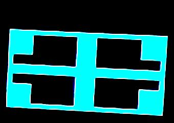
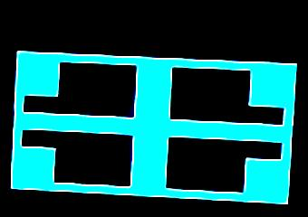
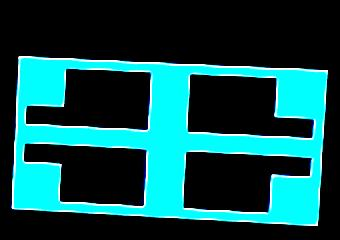
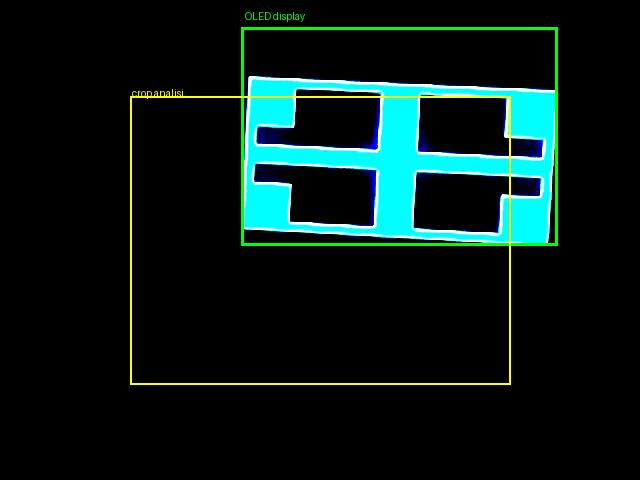

# Test live dell'Observer Sub-Agent — 2026-03-22

> **Hardware**: ESP32 + OLED SSD1306 128×64, Raspberry Pi 3B, webcam CSI IMX219

---

## Cos'è l'Observer Sub-Agent

`observe_display(goal)` è una singola tool call che MI50 può fare.
Internamente, M40 esegue un mini-ReAct loop autonomo con un system prompt dedicato alla visione:

```
MI50 chiama: observe_display({"goal": "verifica..."})
                            │
                            ▼ (context isolato — MI50 non vede nulla di questo)
              M40-Observer mini-loop:
                Step 1: check_display_on()
                Step 2: capture_frames(n=3, interval_ms=1000)
                Step 3: count_objects(frame_paths)
                Step 4: detect_motion(frame_paths)
                Step 5: → report strutturato
                            │
                            ▼
MI50 riceve: {display_on, objects_total, dots, segments,
              motion_detected, success_hint, reason, steps_taken}
```

---

## Fase 1 — Conway (display sparse, webcam non allineata)

**Sketch**: Conway Game of Life (serial: `Generation:0 Alive:299 Stable:0`)

### Risultato check_display_on

```
white_ratio = 0.0011  →  OFF  (sotto soglia 0.003)
```

**Problema**: Conway con 299 cellule vive = 3.6% fill OLED.
L'OLED occupa ~5000px nel webcam frame → ~180px luminosi = 0.06% — sotto soglia.

Anche se Conway girava correttamente, il display risultava OFF per la webcam.

### Frame (contrasto ×8)


Analisi: il cerchio luminoso in alto a sinistra è il **LED di alimentazione dell'ESP32**, non il display OLED.
Il display OLED non era nel campo visivo della webcam.

### Fix applicato: soglia `check_display_on` abbassata

```python
# capture.py
on = wr > 0.001  # era 0.003 — display sparsi sotto soglia
```

---

## Fase 2 — Schermo pieno (display denso, webcam allineata)

**Sketch**: pattern con bordo + croce + angoli pieni

```cpp
display.fillRect(0, 0, 128, 64, SSD1306_WHITE);   // bordo esterno
display.fillRect(4, 4, 120, 56, SSD1306_BLACK);   // interno nero
display.fillRect(0, 28, 128, 8,  SSD1306_WHITE);  // barra orizzontale
display.fillRect(56, 0, 16, 64,  SSD1306_WHITE);  // barra verticale
display.fillRect(0, 0, 20, 20,   SSD1306_WHITE);  // angolo TL
display.fillRect(108, 0, 20, 20, SSD1306_WHITE);  // angolo TR
display.fillRect(0, 44, 20, 20,  SSD1306_WHITE);  // angolo BL
display.fillRect(108, 44, 20, 20,SSD1306_WHITE);  // angolo BR
```

### check_display_on

```
white_ratio = 7.71%  →  ON  ✅   (70× più luminoso di Conway)
```

### Frame catturati — i 3 frame del test finale

**Frame 1** (t=0s) — crop sul display:



**Frame 2** (t=1s):



**Frame 3** (t=2s):



Pattern chiaramente riconoscibile: bordo bianco, croce centrale, quattro riquadri neri.
I tre frame sono identici → `motion_detected: false` corretto (display statico).

### Frame wide con bounding box



- **Verde**: OLED reale nel frame (y=27–245, x=241–557)
- **Giallo**: vecchio crop fisso `analyze.py` (centro 380×288) — tagliava la parte alta

---

## Bug scoperti e fixati

### Bug 1 — Soglia `check_display_on` troppo alta

| | Prima | Dopo |
|--|-------|------|
| Soglia | `wr > 0.003` | `wr > 0.001` |
| Conway (sparse) | ❌ OFF falso | ✅ ON corretto |
| File | `capture.py:155` | |

### Bug 2 — Parser JSON: regex non gestisce annidamento >2 livelli

Il report M40 ha struttura `{"done": true, "report": {"segments": [{"cx":...}]}}` — 3 livelli.
La regex `\{[^{}]*(?:\{[^{}]*\}[^{}]*)?\}` trovava sotto-oggetti interni invece del top-level.

```python
# Prima (observer.py)
for m in reversed(list(re.finditer(r"\{[^{}]*(?:\{[^{}]*\}[^{}]*)?\}", raw, re.DOTALL))):
    ...

# Dopo: raw_decode con filtro chiavi obbligatorie
decoder = json.JSONDecoder()
for pos in [i for i, c in enumerate(raw) if c == "{"]:
    obj, _ = decoder.raw_decode(raw, pos)
    if isinstance(obj, dict) and ("tool" in obj or "done" in obj):
        if best is None or len(obj) > len(best):
            best = obj
```

### Bug 3 — Crop fisso taglia display fuori centro

`_extract_blobs()` in `analyze.py` prendeva sempre il centro del frame (380×288).
Il display OLED era posizionato in alto a sinistra (y=27–245, x=241–557) → crop tagliava la parte superiore.

```python
# Prima: crop centro fisso
mx, my = (w - 380) // 2, (h - 288) // 2
img = img.crop((mx, my, mx + 380, my + 288))

# Dopo: crop adattivo sulla bbox dei pixel luminosi
bright_mask = arr_full > THRESHOLD_OLED
bright_rows = np.where(bright_mask.any(axis=1))[0]
bright_cols = np.where(bright_mask.any(axis=0))[0]
if len(bright_rows) > 10 and len(bright_cols) > 10:
    pad = 20
    y0, y1 = max(0, bright_rows.min()-pad), min(H, bright_rows.max()+pad)
    x0, x1 = max(0, bright_cols.min()-pad), min(W, bright_cols.max()+pad)
    img = img.crop((x0, y0, x1, y1))
```

### Bug 4 — M40 ignora blocks con white_ratio alto

Il system prompt diceva `blocks = artefatti (ignora)`. Ma con white_ratio=7.7%, il blocco grande
IS il contenuto del display (rettangolo pieno). M40 restituiva `success_hint: false` anche con display pieno.

**Fix 1 — System prompt**:
```
blocks >200px. INTERPRETAZIONE:
  - white_ratio < 0.02: blocks = riflesso ambientale → ignora
  - white_ratio >= 0.02: blocks = display con grafica densa → conta come contenuto visivo
```

**Fix 2 — Hint contestuale nel messaggio**:
Dopo `count_objects`, se `white_ratio >= 0.02`, viene aggiunto al messaggio:
```
NOTA: white_ratio=0.078 (>0.02) — i blocks rilevati sono probabilmente
contenuto visivo del display (grafica densa), non riflessi ambientali.
```

---

## Risultato finale — Observer funzionante ✅

### Log del mini-loop (test conclusivo)

```
[Step 1/6] check_display_on()
  ← {on: true, white_ratio: 0.0778}

[Step 2/6] capture_frames(n=3, interval_ms=1000)
  ← {ok: true, n_frames: 3}

[Step 3/6] count_objects(frame_paths)
  ← {total: 0, blocks: 1}
  + NOTA: white_ratio=0.078 — blocks = contenuto visivo

[Step 4/6] detect_motion(frame_paths)
  ← {motion_detected: false, mean_diff: 0.29, confidence: "low"}

[Step 5/6] → REPORT
```

### Output finale

```json
{
  "display_on": true,
  "objects_total": 0,
  "dots": [],
  "segments": [],
  "motion_detected": false,
  "motion_confidence": "low",
  "centroid_displacement": 0.0,
  "text": null,
  "description": "Il display OLED è acceso e mostra un singolo blocco grande che occupa la maggior parte dello schermo. Il white_ratio indica che il blocco è probabilmente contenuto visivo e non un riflesso ambientale.",
  "success_hint": true,
  "reason": "Il display mostra un singolo blocco che occupa la maggior parte dello schermo, soddisfacendo la condizione di un pattern grafico con un'area significativa.",
  "steps_taken": 5
}
```

**Tempo totale: 83.6s** | **5 passi** | **success_hint: true ✅**

---

## Comportamento M40 — valutazione

| Criterio | Risultato |
|----------|-----------|
| Protocollo (1 azione/turno, JSON) | ✅ Perfetto in tutti i test |
| Sequenza tool | ✅ check → capture → count → motion → report |
| Early stop display OFF | ✅ Passo 2, 26.9s |
| Interpretazione white_ratio + blocks | ✅ dopo fix system prompt |
| Ragionamento finale | ✅ Chiaro e corretto |
| Context isolation | ✅ MI50 vede 1 sola tool call |

---

## File modificati in questa sessione

| File | Modifica |
|------|----------|
| `agent/occhio/capture.py` | Soglia ON: `0.003 → 0.001` |
| `agent/occhio/observer.py` | Parser `raw_decode`; hint `white_ratio` per count_objects; system prompt blocks |
| `agent/occhio/analyze.py` | Crop adattivo su bbox pixel luminosi (no più centro fisso) |

---

## Prossimi test (con hardware allineato)

1. **Boids in movimento** → `motion_detected: true`, `dots: N`, `centroid_displacement > 3px`
2. **Snake che cresce** → `segments` aumentano tra due observe consecutive
3. **Testo/score sul display** → `read_text` → `text_found: true`
4. **Display spento intenzionalmente** → early stop passo 2, `success_hint: false`

---

*Condotto: 2026-03-22 ~19:00–20:00 UTC*
*Sketch finale: schermo_pieno (bordo+croce+angoli)*
*4 bug trovati e fixati durante il test live*
